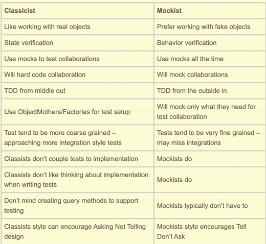

## Test Double

### 용어 정리

```text
- Dummy: 아무 행위를 하지 않는 객체


- Fake: 단순한 형태로 동일한 기능을 수행하나, 프로덕션 환경에서 쓰기에는 부족한 객체
        예를 들어 진짜 Repository가 아닌 Map 객체를 통해 구현한 경우   

 
- Stub: 테스트에서 요청한 것에 대해 미리 준비한 결과를 응답하는 객체, 
        준비한 것 이외의 것은 응답하지 않는다.


- Spy: Stub이면서 호출된 내용을 내부적으로 기록하여 보여줄 수 있는 객체,
       일부는 실제 객체 처럼 동작시키고 일부는 stubbing 할 수 있다.
       

- Mock: 행위에 대한 기대를 명세하고, 그에 따라 동작하도록 만들어진 객체


```

<br/>


### Stub과 Mock의 차이점
```text
- Stub은 상태 검증이 목적

- Mock은 행위 검증이 목적
```

[출처 자료 링크](https://martinfowler.com/articles/mocksArentStubs.html)

<br/>

### Classist VS Mockist
```
[ Classist ]
실제 프로덕션 코드에서 런타임 시점에 일어나는 일을 정확하게 Stubbing했다고 할 수 있을까?
그런 리스크를 안고 가는 것 보다는 비용을 조금 들여서라도, 실제 객체를 테스트 하는 것이 낫다.
-> 실제 객체를 사용하기 때문에 상태 검증이 주를 이룬다.
하지만 외부 시스템같은 어쩔 수 없는 경우일 때는 mock을 사용한다.


[ Mockist ]
대부분 가짜 객체를 사용하여 의존성을 제거한다.
가짜 객체이기 떄문에 특정 상황에서의 행위를 정의해줘야하고
해당 행위에 대한 실행 여부인, 행위 검증이 주를 이룬다.

```


